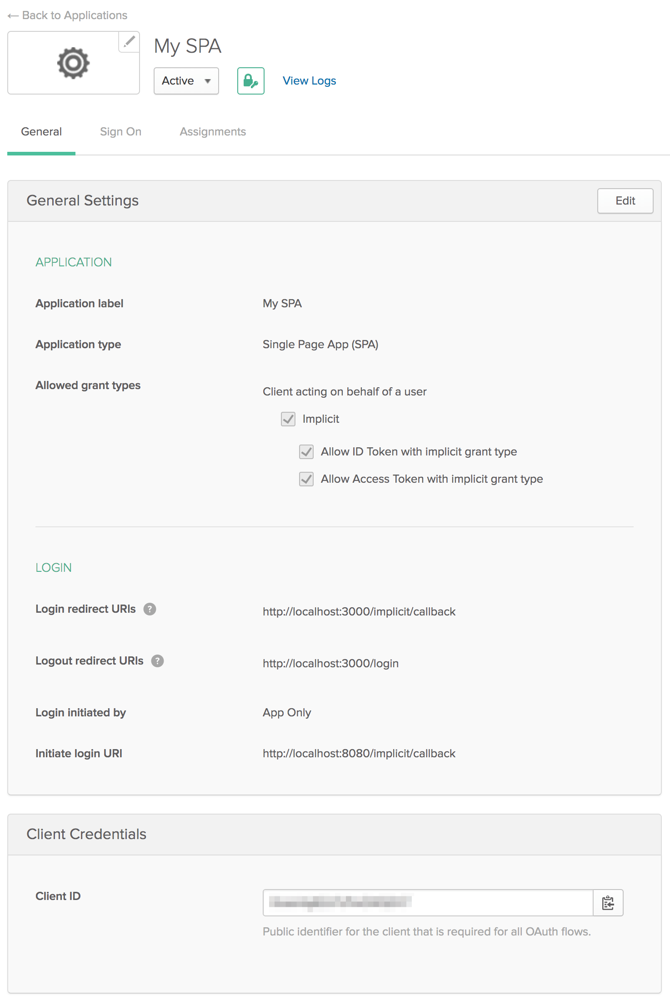
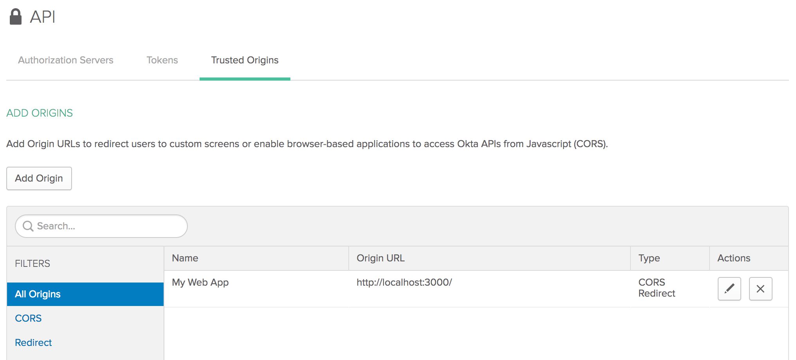

# node-python-okta

Sample deployment of a node front-end reading from a Python backend using Okta authentication and jwt. The Node
client handles authentication via the Okta redirect URI and acquires the id and access tokens. For querying the Python
backend, the React code will send the access token as part of the `Authorization` headers to the Flask app. The
Flask app will parse the access token and hit Okta's [introspect](https://developer.okta.com/docs/api/resources/oidc#introspect)
endpoint to validate the token.

# Okta Setup

You will need to create an Okta Web application. Set the `Login redirect URIs` and `Initiate login URI` to

    http://localhost:3000/implicit/callback

This is where your Node server will be running. Grab the client ID and client secret too.

Next, add `http://localhost:3000/` as a CORS origin under the `API` tab.

The Okta parameters need to be passed into the containers via environment variables. Edit the `.env.template` and
save as `.env` to get the variables propagated into the containers.

    OKTA_CLIENT_ID=<Okta client id>
    OKTA_CLIENT_SECRET=<Okta client secret>
    OKTA_ISSUER=<https://dev-######.oktapreview.com/oauth2/default>
    OKTA_REDIRECT_URI=http://localhost:3000/implicit/callback
    OKTA_SCOPE=openid profile email

The redirect URI will be what you filled into the Okta application settings. The Issuer will be your Okta account URL.
If you signed up for a Developer account, it will be in the format above under the `oktapreview.com` domain.

# Running Locally

Use docker-compose to spin up both the React and Flask containers respectively.

    $ docker-compose up

This spins up a node container serving the front-end on port 3000 and a Flask container serving the back-end
on port 5000

To access the web page, go to (http://localhost:3000/) on your host browser.

# Client Authentication (Node) Resources

* https://github.com/okta/samples-js-react
* https://developer.okta.com/quickstart/#/react/nodejs/express
* https://github.com/okta/samples-nodejs-express-4

# Resource Validation (Python) Resources

* https://developer.okta.com/authentication-guide/tokens/validating-access-tokens
